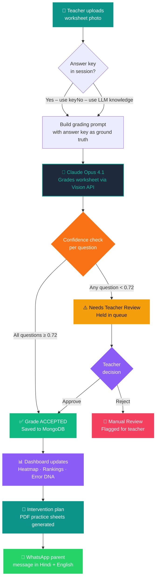
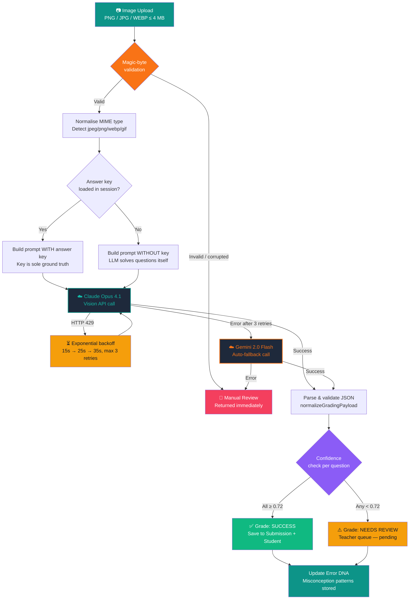
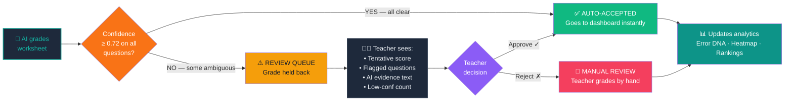
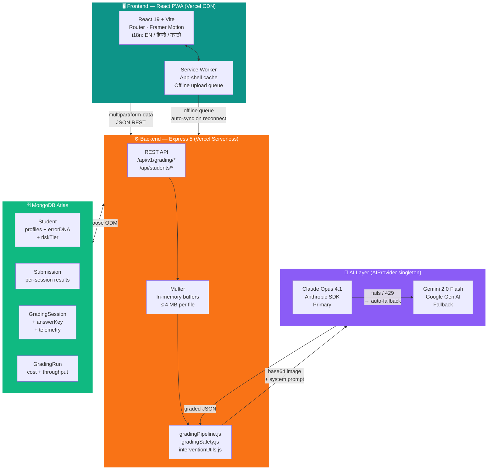

# Mermaid Diagrams — Shiksha Setu Presentation Part 1
# Render each block at https://mermaid.live → export PNG (1400×900px recommended)
# Then include the PNG in the LaTeX slide at the \flowplaceholder{} location.

---

## DIAGRAM 1 — User Flow (Slide 6)
**File to export:** `userflow.png`

---

## DIAGRAM 2 — AI Grading Pipeline (Slide 9)
**File to export:** `pipeline.png`

---

## DIAGRAM 3 — Review Queue Flow (Slide 10)
**File to export:** `reviewqueue.png`

---

## DIAGRAM 4 — System Architecture (Slide 12)
**File to export:** `architecture.png`

---

## RENDERING TIPS
- Go to https://mermaid.live
- Paste each block, set theme to **dark**
- Export as PNG at **1400 × 900** (wide) or **900 × 700** (tall)
- In LaTeX, replace `\flowplaceholder{...}` with:
  `\includegraphics[width=\linewidth]{userflow.png}` etc.
