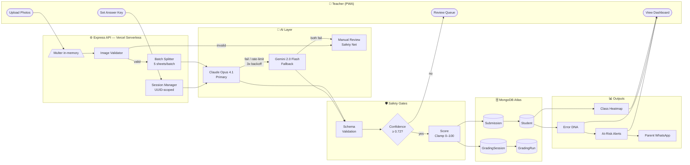
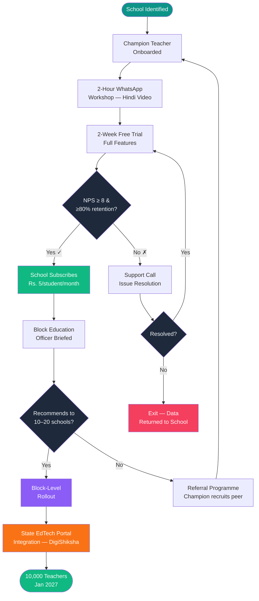
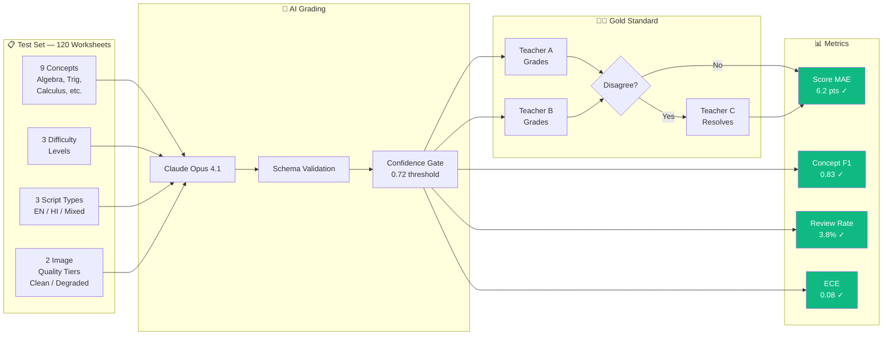
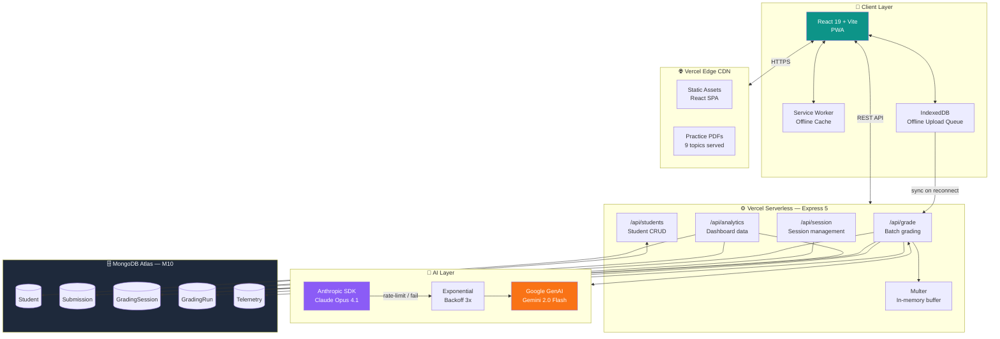

# Mermaid Diagrams — Part 2
**Shiksha Setu | Wadhwani AI Hackathon | Phase 2 Slides 14–28**

Export each diagram from **https://mermaid.live**  
Settings: Theme → **dark** | Background → `#0F172A` | Export → PNG at **1400 × 900 px**

Save to: `frontend/public/figures/` (same folder as part 1 diagrams)

---

## Diagram 1: Full System Data Flow
**File to save:** `figures/full-system-flow.png`  
**Used on:** Slide 27 (Appendix B)  
**Page treatment:** Full page — export at 1600 × 900 px



---

## Diagram 2: Pilot Rollout Flow
**File to save:** `figures/pilot-rollout.png`  
**Used on:** Slide 28 (Appendix C)  
**Page treatment:** Full page — export at 1400 × 900 px



---

## Diagram 3: Phase 2 AI Evaluation Flow
**File to save:** `figures/eval-flow.png`  
**Used on:** Slide 15–16 reference (optional insert)  
**Page treatment:** Full page — export at 1400 × 900 px



---

## Diagram 4: Deployment Architecture (Detailed)
**File to save:** `figures/deployment-arch.png`  
**Used on:** Slide 21 (Deployment & Sustainability) — optional insert  
**Page treatment:** Full page — export at 1600 × 1000 px



---

## Export Instructions

| Diagram | File | Slide | Size |
|---------|------|-------|------|
| Full System Data Flow | `figures/full-system-flow.png` | 27 | 1600×900 |
| Pilot Rollout Flow | `figures/pilot-rollout.png` | 28 | 1400×900 |
| AI Evaluation Flow | `figures/eval-flow.png` | 15–16 (optional) | 1400×900 |
| Deployment Architecture | `figures/deployment-arch.png` | 21 (optional) | 1600×1000 |

### Steps
1. Open [https://mermaid.live](https://mermaid.live)
2. Paste the code block for the diagram you want
3. Click **Config** tab → set `theme: dark`
4. Click **Actions → PNG** → save at the size noted above
5. Place PNG in `frontend/public/figures/` alongside part 1 diagrams
6. Replace `[ Insert Mermaid diagram: X ]` placeholder in the `.tex` file with:
   ```latex
   \includegraphics[width=0.96\linewidth,height=0.70\textheight,keepaspectratio]{figures/FILENAME.png}
   ```
